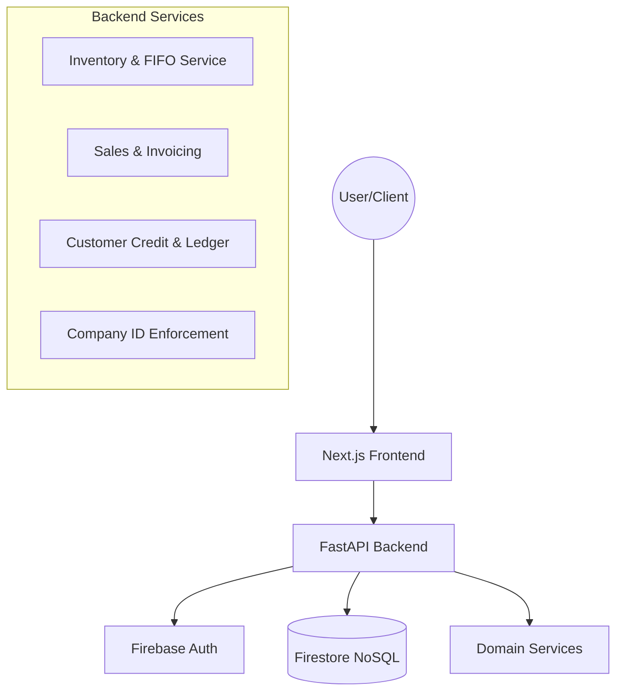

# OpenGate ERP: Warehouse Management System (Lite)

OpenGate ERP is a high-performance, modern Enterprise Resource Planning (ERP) system tailored for the Iraqi market. It is built on a serverless, real-time architecture designed for speed, security, and multi-tenant isolation.

---

## System Architecture

The project is structured as a monorepo with a decoupled Next.js frontend and a FastAPI backend.



### Multi-Tenant Security ("Shared Cabinet, Locked Drawers")
The system ensures strict data isolation between different companies using a `company_id` stamping mechanism:
1. **Case-Sensitive IDs:** All `company_id` values (e.g., `OPENGATE_CORP`) are stored in **UPPERCASE**.
2. **Token Enforcement:** Every API request is validated against the user's Firebase Custom Claims. Users can only access data where their claim's `company_id` matches the document's `company_id`.
3. **Session Stability:** If data appears missing despite being present in Firestore, a simple Logout/Login cycle will refresh the user's "Digital ID Card" (Token).

---

## Core Features

### Inventory & Warehouse
- **Product Catalog:** Manage items with multi-currency pricing (IQD/USD) and category indexing.
- **Stock Movements:** 
    - **Inbound:** Purchase entries with weighted average cost (WAC) updates.
    - **FIFO Cost Layers:** Accurate stock valuation using First-In-First-Out layers.
    - **Adjustments:** Precise control over stock-in/out with audit-ready notes.
- **Low Stock Alerts:** Automated detection of items falling below minimum thresholds.

### Sales & Customers
- **Real-Time Invoicing:** Automated invoice generation with professional templates.
- **Customer Credit Management:** Integrated running balances that support both manual payments and credit carry-overs.
- **FIFO Debt Allocation:** Payments are automatically allocated to the oldest outstanding invoices first.
- **Interactive Statements:** Detailed history of purchases and payments for every customer.

### Teams & Admin
- **Role-Based Access:** Standardized `admin` and `user` roles enforced by backend middleware.
- **Team Management:** Overview of all employees and their respective operational limits.

---

## Tech Stack

| Component | Technology | Rationale |
| :--- | :--- | :--- |
| **Frontend** | Next.js 14+ | Server-side rendering & optimized routing. |
| **Backend** | FastAPI (Python) | High-performance asynchronous execution. |
| **Database** | Firestore | Serverless NoSQL with real-time listeners. |
| **Auth** | Firebase Auth | Secure identity management & custom claims. |
| **Styling** | Vanilla CSS | Premium, custom-tailored visual design. |

---

## Getting Started

### Prerequisites
- Python 3.9+
- Node.js 18+
- Firebase Project configured (Firestore & Auth)

### 1. Backend Setup
```bash
cd backend
pip install -r requirements.txt
# Set environment variables in .env (FIREBASE_PROJECT_ID, etc.)
uvicorn app.main:app --reload
```

### 2. Frontend Setup
```bash
cd frontend
npm install
# Set environment variables in .env.local (NEXT_PUBLIC_FIREBASE_CONFIG)
npm run dev
```

---

## Documentation & Maintenance
- **Core Architecture:** Detailed in the code via FastAPI dependency injection and document-level stamps.
- **License:** Commercial / Private.
- **Maintenance:** Managed by Antigravity AI.
